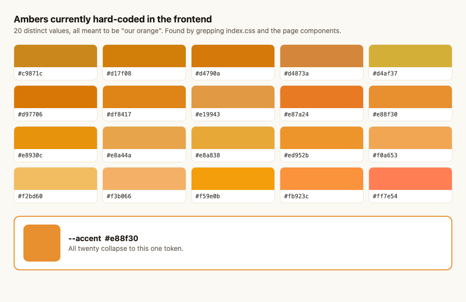
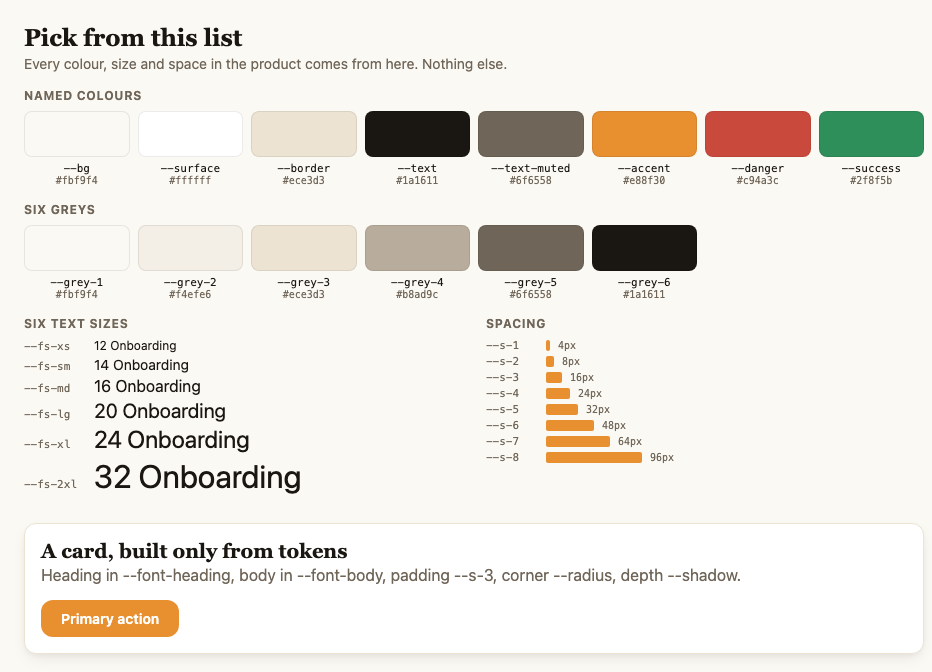

# AndOnboard — frontend design rules

One page. Read it before you write CSS.

Everything visual comes from a short list of variables in
`src/index.css`. If a colour, size or space isn't on the list, it
doesn't go in the product. This document is that list, plus the two
rules that matter.

---

## Why we're doing this

We counted what's actually in the codebase today:

- **20 different ambers** — `#e8930c`, `#df8417`, `#e87a24`, `#ed952b`,
  `#f59e0b`, `#d97706` … all of them meaning "our orange".
- **493 hard-coded colour values** across `index.css`.
- **Two unrelated grey families** mixed together — a warm set
  (`#6f6558`, `#ece3d3`) and a cool Tailwind-stone set (`#78716c`,
  `#a8a29e`, `#44403c`).



Nobody chose this. It's what happens when there's no list to pick from,
and every new screen starts by eyedropping the last one. The fix isn't
discipline, it's having somewhere obvious to pick from.

---

## The list

Defined at the top of `src/index.css`. Copy the variable name, not the
value.



### Colour

| Variable | Value | Use for |
|---|---|---|
| `--accent` | `#e88f30` | The one amber. Primary buttons, active states, focus rings, links. |
| `--bg` | `#fbf9f4` | Page background. |
| `--surface` | `#ffffff` | Cards, modals, anything sitting on the background. |
| `--text` | `#1a1611` | Body and heading text. |
| `--text-muted` | `#6f6558` | Secondary text, captions, labels. Passes AA on both `--bg` and `--surface`. |
| `--border` | `#ece3d3` | Hairlines, dividers, input outlines. |
| `--danger` | `#c94a3c` | Destructive actions, error states. |
| `--success` | `#2f8f5b` | Confirmation, completed states. |

Six greys, lightest to darkest — `--grey-1` … `--grey-6`. The named
colours above point at these, so reach for a named one first and only
use a numbered grey when nothing named fits.

They're warm on purpose. The surface is cream, and a true neutral grey
reads faintly blue against it.

### Spacing

`--s-1` `4px` · `--s-2` `8px` · `--s-3` `16px` · `--s-4` `24px` ·
`--s-5` `32px` · `--s-6` `48px` · `--s-7` `64px` · `--s-8` `96px`

There is deliberately no `12px`. "13px here, 14px there" is the problem
the scale exists to remove — if you feel you need a value between two
steps, pick one of the two.

### Type

- **Headings** — `--font-heading`, Playfair Display
- **Body and UI** — `--font-body`, Outfit

Six sizes, nothing between them:

`--fs-xs` `12px` · `--fs-sm` `14px` · `--fs-md` `16px` ·
`--fs-lg` `20px` · `--fs-xl` `24px` · `--fs-2xl` `32px`

### Shape

`--radius` `12px` · `--radius-full` `999px` (pills, avatars) ·
`--shadow` (cards) · `--shadow-raised` (modals, popovers)

---

## The three questions

Every page answers these three, above the fold, without the person
scrolling or clicking:

1. **Where am I?** — a heading that names the page in the words the
   user would use. Not "Dashboard". "Your onboarding", "All joinees".
2. **What's blocking me?** — anything overdue, rejected, or waiting on
   them, surfaced at the top. If nothing is blocked, say so; silence
   reads as a loading bug.
3. **What should I do next?** — one obvious primary action in
   `--accent`. One. If two things compete for it, neither is primary.

If a page can't answer all three in its top screenful, that's a design
bug, not a content problem. It's the first thing to check in review.

---

## Do / don't

**Do**

- Pick the nearest value on the scale and move on. Don't split steps.
- Use `--text-muted` for de-emphasis, never `opacity` on text — opacity
  drops contrast unpredictably against whatever is behind it.
- Put new shared values in `:root` rather than inventing them locally.
- Check contrast when you put text on `--accent` or on a tinted
  background. 4.5:1 for anything under 24px.
- Keep one primary action per screen.

**Don't**

- Don't paste a hex. If you're typing `#`, you're off the list.
- Don't eyedrop from a screenshot or an existing page — that's exactly
  how 20 ambers happened.
- Don't add a seventh text size because a heading looks two pixels off.
- Don't use `--danger` for emphasis. It means something is wrong.
- Don't name a variable after where it's used (`--login-card-bg`). Name
  it after what it is.

---

## Migration status

The token block is live, but **most of the app still uses the older
`--color-*` / `--space-* `/ `--text-*` variables** defined further down
`index.css`. That set backs roughly 7,900 lines of CSS and is being
retired one page at a time — each page has its own ticket.

Until a page has been migrated, both vocabularies exist. Rules:

- **New code** uses the tokens in this document.
- **Touching an old page?** Migrate the rules you touch, not the whole
  file.
- The legacy block stays until the last page is off it, then it goes.

Verify a page is clean with:

```bash
grep -nE "#[0-9a-fA-F]{3,8}\b|rgba?\(" src/index.css
```

Outside `:root`, that should return nothing for a migrated page.

---

## Open questions for review

Three things I couldn't decide alone, because they change how the
product looks and that isn't a developer's call:

1. **Body font.** The list says Outfit, which is what the app uses
   today, so adopting it changes nothing. But the new brand mockup — and
   the login page built from it — uses **DM Sans**. Either the login
   moves to Outfit, or DM Sans becomes the body font everywhere. Right
   now they disagree.

2. **The type scale shifts existing sizes.** The six sizes above are the
   ones on the ticket. The app currently uses 11, 13, 15, 17, 28 and 38
   as well — none of which survive. Migrating a page means text on it
   visibly changes size. Worth agreeing that's expected before the first
   page ships, so it doesn't read as a regression in review.

3. **`--s-3` is 16px, not 12px.** The ticket's scale skips 12, but 12px
   gaps are common in the current UI. Those all become either 8 or 16.
   Same question: fine, or do we want a 12 on the scale?

---

*Owner: Siddhesh · Reviewer: Rahul · Track A / OP-57*
